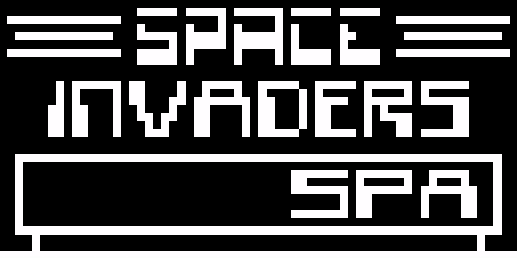

# chip-8
A Chip-8 emulator written in Rust. Implemented as a hobby project to get into emulators.

## References
Written using [Cowgod's Chip-8 Technical Reference](http://devernay.free.fr/hacks/chip8/C8TECH10.HTM)

## ROMS

* Game ROMS: https://www.zophar.net/pdroms/chip8/chip-8-games-pack.html
* Test ROM: https://github.com/metteo/chip8-test-rom
